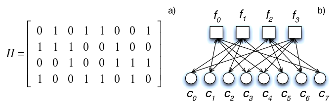

# Background
We provide here a very brief background on error correction codes, specifically linear codes and LDPC codes. The core idea of error correction is to add some redundancy to a message to be communicated (to obtain a codeword), so that the receiver can recover back the message from a corrupted version of the transmitted codeword. The aim of this page is to introduce the reader to some of the concepts and notation relevant to this work. It is not meant to be a comprehensive introduction or a tutorial for these topics. See the [References](references.html) page for more resources including papers and learning material on these rich topics. We focus here on the binary alphabet with modulo 2 addition and multiplication.

## Table of Contents
* [Linear codes](#linear-codes)
  * [Parity check matrix](#parity-check-matrix)
  * [Generator matrix](#generator-matrix)
* [LDPC codes](#ldpc-codes)
  * [Representation](#representation)
  * [Decoding](#decoding)
  * [Types of LDPC codes](#types-of-ldpc-codes)
  * [Puncturing](#puncturing)

## Linear codes

Linear codes were developed as a means to enable the correction of errors induced in the transmission of data. They are defined by their property that the linear combination of codewords is a codeword. Most linear codes can be classified as either block codes or convolutional codes, and this library focuses on block codes.

**Notation:** We denote the message length as `k`, the encoded codeword/block length as `n` and the number of parity checks (defined later) as `m = n - k`. The rate of the code is given by `k/n`, which is generally lower than 1. The message is denoted by `x` and is a binary row vector of size `k`. The codeword is denoted by `c` and is binary row vector of size `n`.

A linear code encoder can be thought of as a linear mapping (generator) from `{0,1}^k` (message space) to `{0,1}^n` (codeword space). The decoder receives a corrupted codeword and aims to recover the transmitted codeword and hence the message. We can equivalently describe the space of all codewords through its null space, which defines a set of `m` linear equations that must evaluate to zero for all codewords. By the [rank-nullity theorem](https://en.wikipedia.org/wiki/Rank%E2%80%93nullity_theorem) from linear algebra, the dimensions of the spaces follow the equality `k + m = n`. Linear codes in general do not have efficient decoding algorithms, therefore special classes of these codes have been developed with structures that enable efficient decoding. Depending on the type of linear code, the generator or the parity check representation might be more illustrative of its properties. We consider both of these below.

### Parity Check Matrix
The parity check matrix `H` has dimensions `(n-k)` by `n`, with each row of the matrix defining one parity check equation for the code. The space of all codewords can be defined by the set of row vectors `c` of length `n` that satisfy `Hc' = 0` (where `c'` is the transpose of `c`).

The matrix containing the cumulation of parity check equations is known as the parity check matrix. Its width n is equivalent to the length of all codewords defined by the code. Assuming a binary character system, the number of all messages of length n is equal to 2n. By including a nonzero number of parity check equations, the number of codewords that conform to the code decreases.

As the number of possible codewords decreases, but the length of all codewords stays the same, the distance between codewords increases where distance is defined by the number of nonidentical values between two codewords. For example, there is a distance of 3 between the codewords 100101 and 000011. The minimum distance between any two possible codewords that conform to a given code is known as the hamming distance of that code. This value is important - the larger the hamming distance, the larger the necessary corruption to render a received message undecodeable.

### Generator Matrix
The generator matrix `G` has dimensions `k` by `n`, with the rows defining a basis for codeword space. For a given message `x` (row vector of length `k`), the corresponding codeword can be computed as `xG`. Hence the space of all codewords can be defined by varying `x` over all vectors in `{0,1}^k`.

While a given generator matrix or a given parity check matrix defines the space of codewords, specifying `G` does not completely specify `H` (and vice versa). For example, permuting the rows of `H` has no impact on the code. As we will see below for the LDPC codes, parity check matrices with specific properties (e.g., sparsity) can enable efficient decoding algorithms. Similarly, specific generator matrix `G` structures can enable efficient encoding. The generator matrix for any code can be transformed to a _systematic_ generator matrix for the same code, where a systematic matrix encodes the message in such a way that the message `x` is embedded in the codeword `c` (equivalently, the identity matrix of size `k` is a submatrix of `G`).

## LDPC Codes
(L)ow (D)ensity (P)arity (C)heck Codes are linear codes which are defined by particularly sparse parity check matrices. LDPC codes have been shown to achieve near-optimal performance at large blocklengths as well as excellent performance for practical parameter settings. This is enabled by an efficient decoding algorithm (discussed below) that relies on the sparsity of the parity check matrix.

### Representation
The parity check matrix of the LDPC code is often represented in terms of a sparse bipartite graph called the Tanner graph - consisting of `m` check nodes representing the parity checks and `n` variable nodes representing the bits in the codeword. An edge is present between a check node and a variable node if the corresponding entry in the parity check matrix is 1. This representation is useful for representing the code efficiently by storing only the edges and not the large number of 0s in the parity check matrix. It is also useful for understanding and implementing the decoding algorithm which can be thought of as iterative message passing between the variable and check nodes.

For example, consider the following code in both its parity check matrix and Tanner graph representation (source: [Cumplido et al. (2010)](https://drops.dagstuhl.de/opus/volltexte/2010/2895/pdf/10281.CumplidoRene.Paper.2895.pdf)):

This example has parameters `n = 8`, `m = 4`, `k = 4` and rate of 1/2. This is also a _regular_ LDPC code, where each check node is connected to 4 variable nodes, and each variable node is connected to 2 check nodes. This can be seen in the matrix as well, with each row having exactly 4 ones and each column having exactly 2 ones.

### Decoding
LDPC codes are usually decoded with an efficient (but suboptimal) algorithm called iterative belief propagation/message passing. The algorithm works with log-likelihood ratios (LLRs) which represent the probability of each bit being 0 or 1. Initially the variable nodes receive the LLRs based on the received signal and the channel model. Then multiple iterations of message passing are performed. In each iteration, first the variable nodes send their LLRs to the check nodes. Each check node compiles the LLRs from the connected variable nodes and then sends back updated LLRs based on the fact that the parity check equation must be satisfied. Then the variable nodes compile the LLRs received from the connected check nodes and update the LLR value based on the received messages and the value from the channel. After some number of iterations, the LLR values are thresholded to get the decoded binary codeword. Under suitable circumstances this algorithm can be shown to converge to the correct codeword. Since the algorithm provides near-optimal error correction performance and can be implemented efficiently on software and hardware, LDPC codes with iterative decoding have been used in several applications and communication standards since their reintroduction in late 1990s.

### Types of LDPC codes
LDPC codes can be further classified according to their characteristics and constructions.

The three most relevant to this library are:
* Regular codes
* Irregular codes
* Protograph codes

**Regular codes:** Regular LDPC codes are defined by two numbers `(c,r)` (e.g. a `(3,6)`-regular code). The code is "regular", i.e., each check node is connected to exactly `r` variable nodes, and each variable node is connected to exactly `c` check nodes. Thus, the parity check matrix has constant row weight of `r` and constant column weight of `c`. Regular codes are the simplest LDPC codes and generally cannot achieve the optimal performance in theory. However, they have good distance properties and perform quite well for practical block lengths, especially at high rates.

**Irregular codes:** Irregular LDPC codes have a probability distribution over the check node and variable node degrees, and hence are a generalization of regular codes. These distributions can be optimized to achieve better theoretical performance than regular codes, although the practical performance at reasonable block lengths can be worse and in practice, the code needs to be modified for best results.

**Protograph codes:** Protograph LDPC codes combine the best properties of regular and irregular LDPC codes. These codes start with a small protograph with suitable properties and then expand the protograph to a larger LDPC code. By optimizing the protograph, the expanded code can contain desirable properties such as near-optimal theoretical performance as well as excellent performance for practical block lengths. The fact that the properties of the code are largely determined by the small protograph makes the search for good protograph codes easier.

### Puncturing

Puncturing is a technique to increase the rate of a code, allowing us to generate multiple codes of different rates starting with the same code. The idea is to take the encoded codeword for a low-rate code and then transmit only a subset of the bits in the codeword (the untransmitted bits are said to be _punctured_). At the decoder, the punctured bits are assumed to be erased, which translates to equal probability of being 0 or 1 during LLR computation.

The selection of punctured bits can be done randomly or in a more structured manner by puncturing the bits that are strongly protected and hence are more likely to successfully recover from an erasure. Protograph codes are particularly suited for this type of structured puncturing, since the punctured bits can be specified in the protograph itself. After the protograph expansion, all the bits derived from the punctured variable nodes in the protograph are punctured. 
