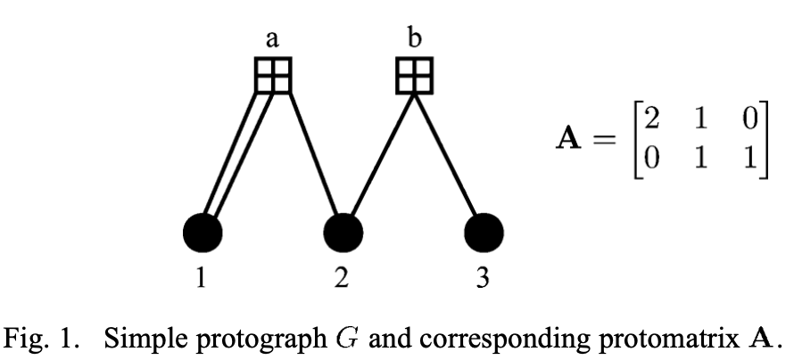
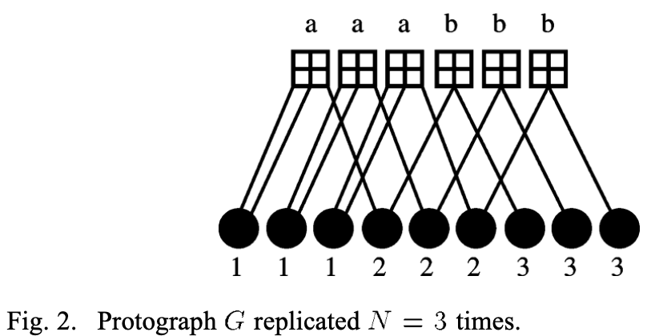
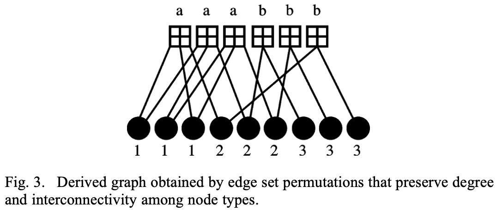
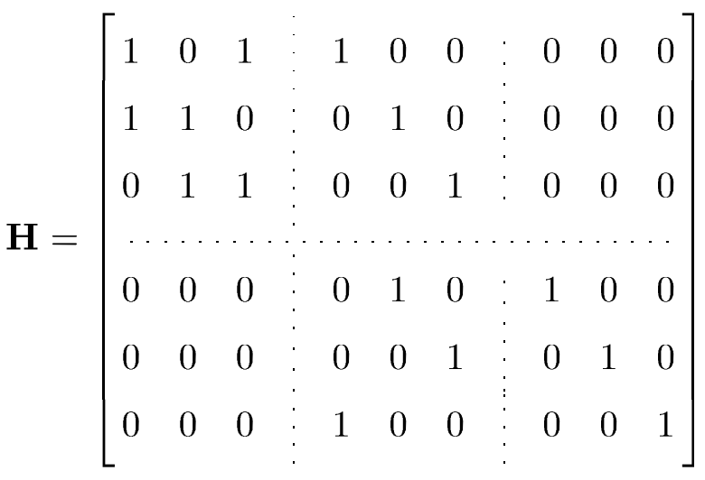

# Protograph code construction
## Table of Contents
* [Background](#background)
* [Construction methods](#construction-methods)
  * [peg](#peg) (default)
  * [sum-permutations](#sum-permutations)
  * [quasi-cyclic](#quasi-cyclic)
  * [permuted-quasi-cyclic](#permuted-quasi-cyclic)

## Background

This library includes different constructions for the creation of Protograph-based LDPC Codes. Protograph codes are created through the expansion of a base protograph. The resulting LDPC code matrix is a combination of "submatrices", each submatrix constructed according to the corresponding degree specified in the protograph. Given an expansion factor `N`, these submatrices are strictly `N` by `N` dimensions.

We start with a protograph whose matrix representation has width `n_p`, height `m_p` an expansion factor `N` and is populated with non-negative integers. This can be represented as a graph with `n_p` variable nodes, `m_p` check nodes, and the number of connections between a given variable and check node defined by the corresponding entry in the matrix. The resulting LDPC code would be representable by a `m x n` matrix, where `m = m_p x N` and `n = n_p x N`. Suppose the `(i,j)`th entry in the protograph has value (weight) of `w`, then the submatrix `(i x N: (i+1) x N, j x N: (j+1) x N)` in the expanded matrix has exactly `w` 1s in each row and in each column. Note that `0 <= w <= N`. As an example, when `w = 0` the submatrix is the all-zeros matrix and when `w = 1` the submatrix can be any permutation matrix.

Note that the construction algorithm does not take puncturing into account. Puncturing is considered after the parity check matrix construction to determine which of the bits in the expanded matrix should be transmitted. This is determined by the transmitted bits in the protograph itself - all the corresponding bits in the expanded matrix are also transmitted.

We show below an small example obtained from [Butler and Siegel (2013)](https://ieeexplore.ieee.org/document/6482231) that should help illustrate this better. The example has parameters `m_p = 2`, `n_p = 3` and `N = 3`.










## Construction methods
As discussed in the background section, the protograph code construction boils down to construction of the submatrices with the following properties:
- dimension `N x N` (where `N` is the expansion factor)
- each row and column containing `w` 1s (where `w` is the value in the protograph matrix satisfying `0 <= w <= N`)

The different construction methods below only differ in the submatrix generation algorithms and hence we focus on that aspect in what follows. When `w = 0`, the submatrix is the all-zeros matrix for all the construction methods.

### peg

This is the default construction method and generates a submatrix equivalent to a [regular code](methods-regular.html) built according to parameters `n = N`, `m = N`, `c = w` (column weight) with the `peg` construction described [here](methods-regular.html#peg). The construction method was chosen over other regular construction methods as it is the current state-of-the-art for regular code construction. When `w = 1`, we found that the `peg` algorithm always generated the identity matrix which led to issues due to insufficient randomness. Thus we replaced `peg` with a permutation matrix when `w = 1`.

### sum-permutations

This construction generates a submatrix the result of a summation of `w` random non-overlapping permutation matrices of size `N`. The resulting matrix is strictly regular in the weights of its rows and columns since each permutation matrix adds a single 1 to each row and to each column of the submatrix.

This library provides a [class](https://github.com/shubhamchandak94/ProtographLDPC/blob/master/LDPC-library/libs/Identity.py) for the handling of the special case of Tanner graphs for permutation matrices. This construction utilizes this API to generate the respective submatrices.

### quasi-cyclic

This construction generates a [circulant](https://en.wikipedia.org/wiki/Circulant_matrix) submatrix according to the following algorithm:

The first row is populated randomly with `w` 1s. Each of the following `N-1` rows is the circular right shifts of the preceding row. The resulting matrix has exactly `w` 1s in each row and in each column. As discussed in [Future work](future-work.html), quasi-cyclic matrices have certain nice properties enabling efficient encoding and are used as part of several standards. However, additional construction optimizations are needed to get the best performance from such matrices.

A sample submatrix obtained from this construction is shown below (with `N = 6`, `w = 2`).
```
0 1 0 0 0 1
1 0 1 0 0 0
0 1 0 1 0 0
0 0 1 0 1 0
0 0 0 1 0 1
```

### permuted-quasi-cyclic

This construction generates a submatrix by first generating a submatrix with the `quasi-cylic` construction above and then permuting the rows and the columns of the submatrix. This leads to more randomness in the construction and hence generally better results than the `quasi-cylic` construction (see [Simulations](simulations.html)). We show below a sample submatrix generated by permuting the rows and columns of the `quasi-cylic` example above.

```
0 1 0 1 0 0
0 0 1 0 1 0
1 0 0 1 0 0
0 0 0 0 1 1
1 1 0 0 0 0
0 0 1 0 0 1
```
