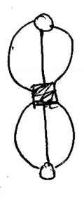
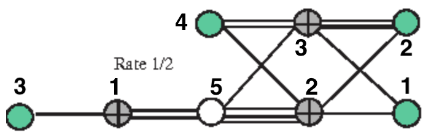

# Sample protographs
In order to generate a protograph LDPC code, a protograph file must be supplied to the make-pchk program.
This file has the following format (`#` here denotes commments, which are NOT allowed in the actual protograph files):

```
n_checks n_bits # protograph dimensions
transmitted_bits [list of transmitted indices (1-based)] # optional, only needed when puncturing
mode # can be sparse or dense
protograph representation
```
If `mode` is `sparse`, `protograph representation` is given by a list of matrix entries, one per line. Each list element contains three space separated integers: the row index within the protograph matrix, the column index within the protograph matrix, and the entry value at that given matrix location. The row and column indices are 1-based.

If `mode` is `dense`, `protograph representation` is given by the matrix representation of the protograph, with one row on each line.

We first consider a very simple protograph (from Figure 1 [here](https://web.stanford.edu/class/ee388/HOMEWORK2018/lecture-6-7.pdf)) with 1 check node and 2 variable nodes. The check node has three connections to each variable node.



The corresponding matrix representation is simply
```
3 3
```
and the corresponding protograph representation is
```
1 2
dense
3 3
```
or
```
1 2
sparse
1 1 3
1 2 3
```
or
```
1 2
transmitted_bits 1 2
dense
3 3
```
Observe that the `transmitted_bits` row is not required in this case because all the variable nodes are transmitted and there is no puncturing.

We now consider a more complex example of the AR4JA rate 1/2 protograph (figure from [Divsalar et al. (2006)](https://ieeexplore.ieee.org/document/4036046)).



The protograph is defined by the following matrix:
```sh
0 0 1 0 2
1 1 0 1 3
1 2 0 2 1
```
and the 5th variable node (shown in white in the figure) is untransmitted/punctured. The corresponding protograph files in sparse and dense representations are shown below.

_Dense_
```
3 5
transmitted_bits 1 2 3 4
dense
0 0 1 0 2
1 1 0 1 3
1 2 0 2 1
```

_Sparse_
```
3 5
transmitted_bits 1 2 3 4
sparse
1 3 1
1 5 2
2 1 1
2 2 1
2 4 1
2 5 3
3 1 1
3 2 2
3 4 2
3 5 1
```

You can find a list of example protograph files [here](https://github.com/shubhamchandak94/ProtographLDPC/tree/master/sample-protographs). These include the AR4JA and AR3A protographs at rates 1/2, 2/3 and 3/4, along with certain other optimized protographs from [Fang et al. (2016)](https://ieeexplore.ieee.org/abstract/document/7112076).
