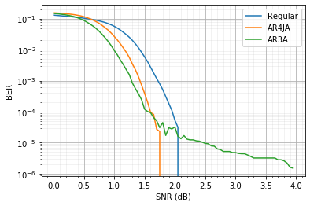
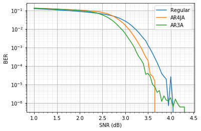
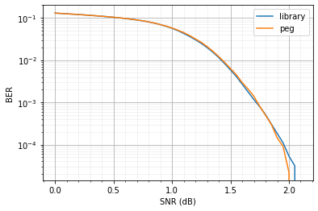
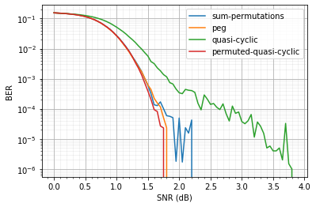
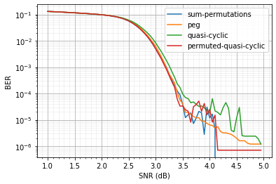

# Simulations

This page contains some simulation results comparing different codes (both regular and protograph) as well as different construction methods. We first describe the experiments and then proceed to the results. For details on the different construction methods and the various protographs, see the [Methods](methods.html) page.

## Table of Contents
* [Experimental details](#experimental-details)
* [Comparison of regular and protograph codes](#comparison-of-regular-and-protograph-codes)
* [Comparison of construction methods for regular codes](#comparison-of-construction-methods-for-regular-codes)
* [Comparison of construction methods for protograph codes](#comparison-of-construction-methods-for-protograph-codes)
* [Summary](#summary)

## Experimental details
The Jupyter notebook used for running the experiments and generating the plots is [available on the repository](https://github.com/shubhamchandak94/ProtographLDPC/blob/master/simulations/simulations.ipynb). The corresponding directory also contains the data produced and the saved plots.

- For all the experiments, we fix the block size (length of codeword) to 2000 (upto minor variation due to integer constraints in protograph codes).
- The binary input AWGN channel for consistency with the survey paper [Fang et al. (2016)](https://ieeexplore.ieee.org/abstract/document/7112076). The channel is described [here](https://shubhamchandak94.github.io/LDPC-codes/channel.html) and the conversion between the SNR in dB and the standard deviation (sd) is given by `sd = 10^(-snr/20)`.
- For each code, the SNR is varied across a range and at each SNR, 5000 blocks are transmitted and decoded to compute the bit error rate (BER) and the frame/block error rate (FER). Only the BER plots were generated because of the small scale of the experiments.
- Some of the plots are noisy at higher SNRs because we didn't have enough resolution at low BERs due to the limited experiment size.

## Comparison of regular and protograph codes
Here we compare a regular code with the AR4JA and AR3A protographs (see Sample Protographs [here](methods-sample-protographs.html)). We compare these codes for rate `1/2` and `2/3`. Note that the two protographs have a parameter `n` that allows setting the rate to `(n+1)/(n+2)`. For these plots, we use the default `peg` construction method for each code.

*Comparison of rate 1/2 codes*  
  

*Comparison of rate 2/3 codes*  
  

Looking at the plots above we can make the following observations (which are consistent with the results from [Fang et al. (2016)](https://ieeexplore.ieee.org/abstract/document/7112076)):
- Rate `1/2` codes perform better than rate `2/3` codes at the same SNR.
- The AR4JA protograph outperforms the regular codes for both rates.
- The AR3A protograph has lower BER than the AR4JA protograph for low SNRs but has a poor error floor and does not achieve good performance at higher SNRs. This is due to the worse minimum distance properties of the AR3A protograph.

In practice, an appropriate protograph can be chosen for the channel of interest by following the guidance in [Fang et al. (2016)](https://ieeexplore.ieee.org/abstract/document/7112076). The [GitHub repository](https://github.com/shubhamchandak94/ProtographLDPC/tree/master/sample-protographs) contains some other protographs to experiment with.

## Comparison of construction methods for regular codes
We compare two different construction methods for the regular codes at the two rates. Apart from the default `peg` construction method in this library (details [here](methods-regular.html#peg)), we also test the construction method `evenboth no4cycle` from the base library (details [here](https://shubhamchandak94.github.io/LDPC-codes/pchk.html#ldpc)). The base library construction method is labeled as `library` in the plots below.

*Comparison of construction methods for rate 1/2 regular code*  
  

*Comparison of construction methods for rate 2/3 regular code*  
  

Based on the plots above, the `peg` construction outperforms the `library` construction.  This might be because PEG performs a more systematic elimination of short cycles as compared to the base library.

## Comparison of construction methods for protograph codes
We compared different construction methods for the AR4JA and AR3A protograph codes at the two rates.

*Comparison of construction methods for rate 1/2 AR4JA code*  
  

*Comparison of construction methods for rate 2/3 AR4JA code*  
  

*Comparison of construction methods for rate 1/2 AR3A code*  
  

*Comparison of construction methods for rate 2/3 AR3A code*  
  

Based on the plots above, we see that the `quasi-cyclic` construction consistently does worse, which is expected due to the worse minimum distance properties (e.g., see [Mitchell et al. (2014)](https://ieeexplore.ieee.org/document/6089477)). We included this construction for reference since it enables more efficient encoding, and a variation is used in the 5G standard (see [Future work](future-work.html)). Among the other constructions, there is no clear winner, although the default `peg` construction is generally close to the best.

## Summary
In practice, the user should perform multiple random samplings of the code with different seeds and select the protograph, the construction and the random realization that performs the best for the channel of interest. The provided [test scripts](usage.html#test-scripts) and the [Jupyter notebook](https://github.com/shubhamchandak94/ProtographLDPC/blob/master/simulations/simulations.ipynb) for simulations can be useful for this purpose.
